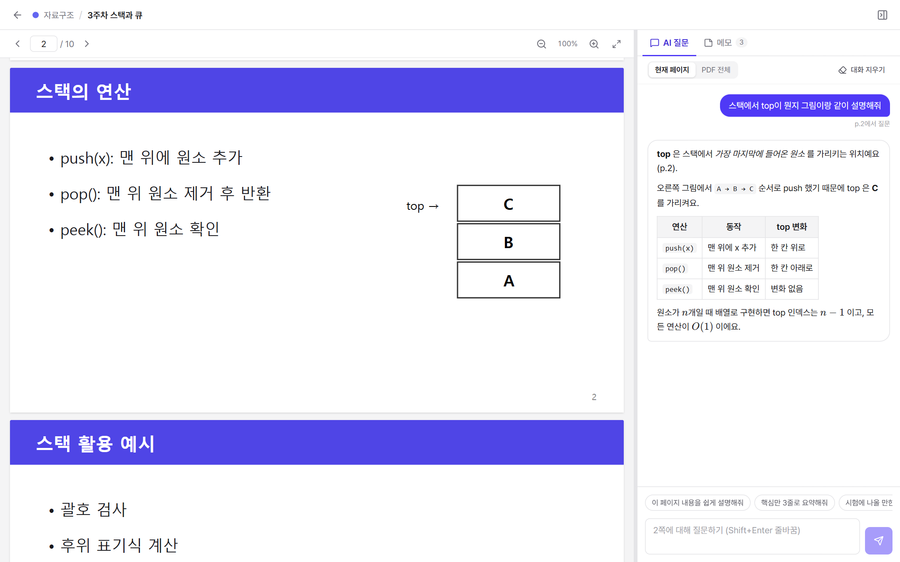
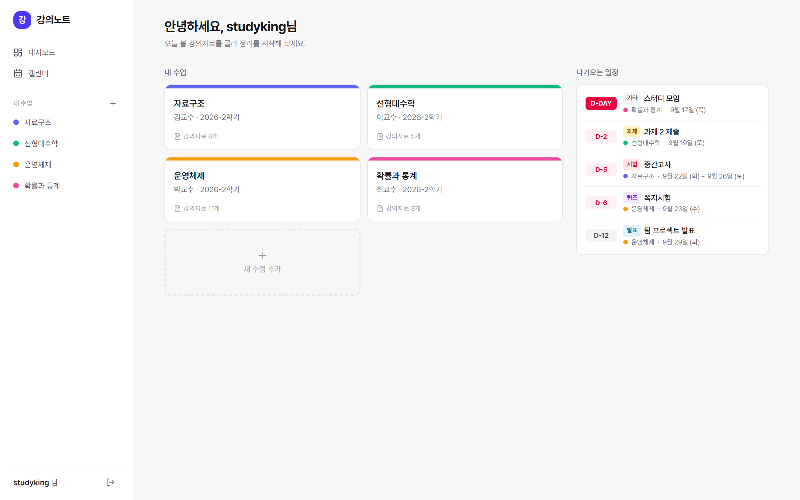
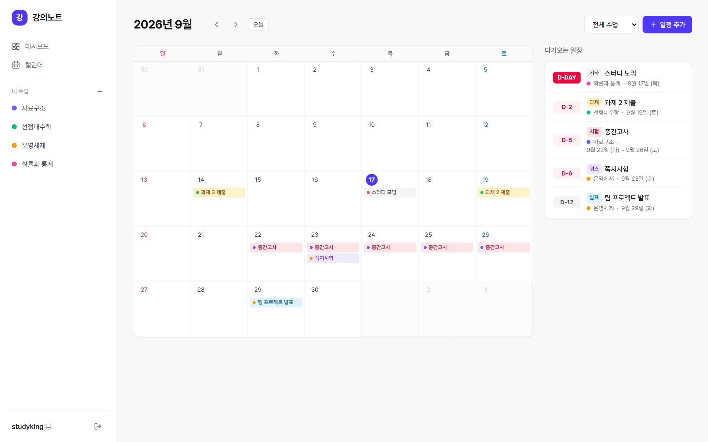
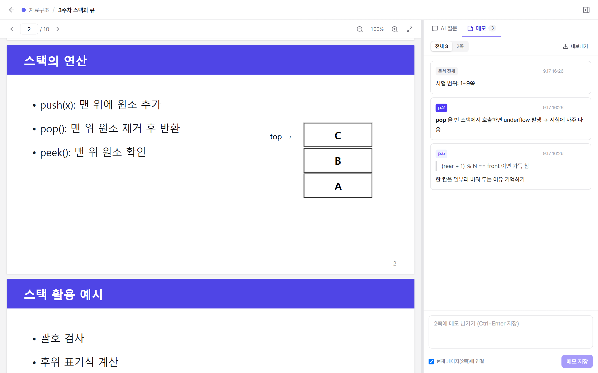
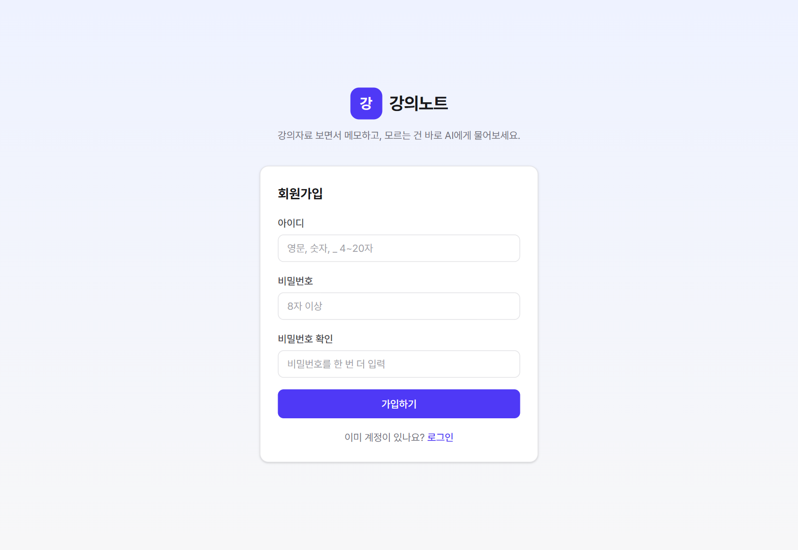
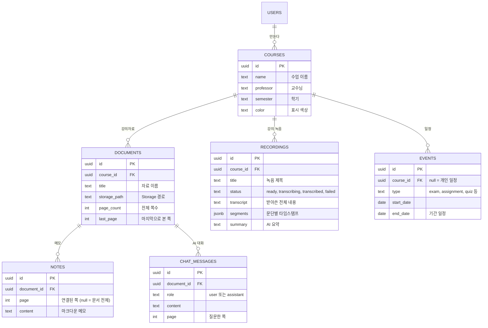
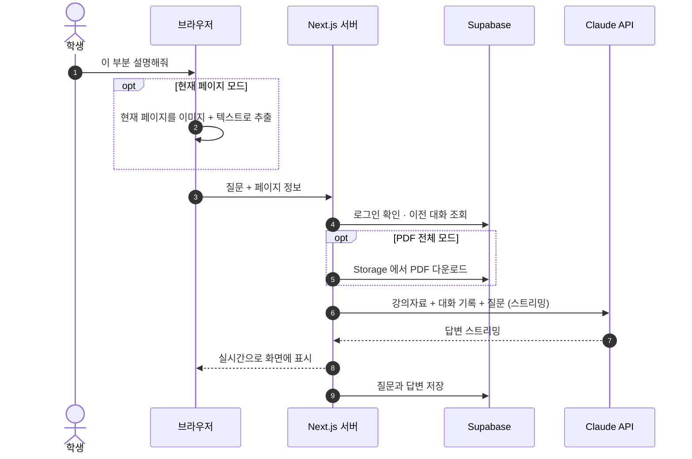

<div align="center">

# 📚 강의노트 · Lecture Campus

**강의자료 PDF를 보면서 메모하고, 모르는 건 바로 AI에게 물어보는 학습 정리 공간**

수업을 놓쳐도 괜찮아요. 슬라이드 한 장 한 장을 AI 튜터와 함께 이해하고, 필요한 내용은 페이지별 메모로 남기세요.

<br />


<br />


<br />



<sub>PDF를 보면서 오른쪽에서 AI에게 질문하는 학습 화면</sub>

</div>

<br />

## 📖 목차

- [✨ 주요 기능](#-주요-기능)
- [🖼️ 화면 미리보기](#️-화면-미리보기)
- [🛠 기술 스택](#-기술-스택)
- [🚀 시작하기](#-시작하기)
- [🗂 프로젝트 구조](#-프로젝트-구조)
- [🧩 데이터 구조](#-데이터-구조)
- [🤖 AI 질문은 이렇게 동작해요](#-ai-질문은-이렇게-동작해요)
- [☁️ 왜 Supabase인가요?](#️-왜-supabase인가요)
- [🌐 배포하기](#-배포하기)
- [🗺️ 로드맵](#️-로드맵)

<br />

## ✨ 주요 기능

<table>
  <tr>
    <td width="50%" valign="top">
      <h3>📄 PDF 뷰어</h3>
      <ul>
        <li>연속 스크롤 · 페이지 이동 · 확대/축소</li>
        <li>한글 PDF 완벽 지원</li>
        <li>보이는 페이지만 렌더링해서 수백 쪽도 가볍게</li>
        <li><b>마지막으로 본 페이지</b>에서 이어 보기</li>
        <li><kbd>←</kbd> <kbd>→</kbd> 키로 페이지 넘기기</li>
      </ul>
    </td>
    <td width="50%" valign="top">
      <h3>🤖 AI 질문</h3>
      <ul>
        <li><b>현재 페이지</b>(이미지+텍스트) 또는 <b>PDF 전체</b>를 보고 답변</li>
        <li>실시간 스트리밍 답변 · 수식(LaTeX) · 표 렌더링</li>
        <li>"쉽게 설명해줘", "시험 문제 만들어줘" 빠른 질문</li>
        <li>대화 기록 저장, 답변을 <b>메모로 바로 저장</b></li>
      </ul>
    </td>
  </tr>
  <tr>
    <td width="50%" valign="top">
      <h3>📝 메모</h3>
      <ul>
        <li>페이지에 연결된 메모 — 클릭하면 해당 페이지로 이동</li>
        <li>PDF에서 문장을 드래그해서 <b>인용</b>하기</li>
        <li>마크다운 · 수식 지원</li>
        <li><code>.md</code> 파일로 내보내기</li>
      </ul>
    </td>
    <td width="50%" valign="top">
      <h3>🗓 캘린더 &amp; 수업 관리</h3>
      <ul>
        <li>수업 생성 · 조회 · 수정 · 삭제 (색상 지정)</li>
        <li>시험 · 과제 · 퀴즈 · 발표 일정</li>
        <li><b>시험 기간</b>처럼 여러 날에 걸친 일정</li>
        <li>대시보드에 <b>D-day</b> 표시</li>
      </ul>
    </td>
  </tr>
  <tr>
    <td width="50%" valign="top">
      <h3>🎙️ 강의 녹음 &amp; 받아쓰기</h3>
      <ul>
        <li>브라우저에서 바로 녹음 (일시정지 · 이어서 녹음)</li>
        <li>가지고 있는 오디오 파일 업로드도 가능</li>
        <li>한국어 자동 받아쓰기 (Deepgram Nova-3)</li>
        <li>문단별 <b>타임스탬프를 누르면 그 부분부터 재생</b></li>
      </ul>
    </td>
    <td width="50%" valign="top">
      <h3>🧾 AI 요약</h3>
      <ul>
        <li>받아쓴 강의를 <b>흐름 · 핵심 개념 · 시험 포인트</b>로 정리</li>
        <li>녹음 없이 <b>전사문을 붙여넣어</b> 요약만 받기도 가능</li>
        <li>실시간 스트리밍 · 마크다운 · 수식 지원</li>
      </ul>
    </td>
  </tr>
</table>

> 💡 **꿀팁** — PDF에서 모르는 문장을 드래그하면 `AI에게 질문` / `메모에 인용` 버튼이 나타나요.

<br />

## 🖼️ 화면 미리보기

| 대시보드 | 캘린더 |
| :---: | :---: |
|  |  |
| 내 수업과 다가오는 일정(D-day) | 시험 기간 · 과제 마감을 한눈에 |

| 페이지별 메모 | 회원가입 |
| :---: | :---: |
|  |  |
| 메모를 누르면 해당 페이지로 이동 | 아이디 + 비밀번호(8자 이상) |

<br />

## 🛠 기술 스택

| 분류 | 사용 기술 |
| --- | --- |
| **Frontend** | Next.js 16 (App Router), React 19, TypeScript, Tailwind CSS 4, lucide-react |
| **Backend** | Next.js Route Handler · Server Actions · Proxy |
| **Database / Auth / Storage** | Supabase (Postgres + RLS, Auth, Storage) |
| **PDF** | react-pdf (PDF.js) |
| **AI** | Claude API (`@anthropic-ai/sdk`), 스트리밍 응답 · 프롬프트 캐싱 |
| **받아쓰기** | Deepgram Nova-3 (한국어, 서명 URL 전달 방식) |
| **Markdown** | react-markdown, remark-gfm, remark-math, rehype-katex |

<br />

## 🚀 시작하기

### 1️⃣ Supabase 설정

1. [supabase.com](https://supabase.com) 에서 프로젝트를 만듭니다.
2. **SQL Editor** 에서 [`supabase/schema.sql`](supabase/schema.sql) 을 통째로 붙여넣고 **Run**
   → 테이블 6개 + 보안 정책(RLS) + PDF · 녹음 저장 버킷이 한 번에 만들어져요.
   (예전 버전을 이미 실행한 프로젝트라면 [`supabase/migrations/`](supabase/migrations) 의 최신 파일만 추가로 실행해도 돼요)
3. **Authentication → Sign In / Providers → Email**
   - ⚠️ **Confirm email 끄기** (아이디로 가입하기 때문에 인증 메일을 받을 곳이 없어요)
   - Minimum password length → `8` (선택)

### 2️⃣ 환경변수

`.env.example` 을 복사해서 `.env.local` 을 만들고 값을 채웁니다.

```bash
cp .env.example .env.local
```

| 변수 | 필수 | 설명 |
| --- | :---: | --- |
| `NEXT_PUBLIC_SUPABASE_URL` | ✅ | Supabase 프로젝트 URL |
| `NEXT_PUBLIC_SUPABASE_PUBLISHABLE_KEY` | ✅ | Supabase Publishable key (또는 anon key) |
| `ANTHROPIC_API_KEY` | AI 사용 시 | [Anthropic Console](https://console.anthropic.com) 에서 발급 |
| `ANTHROPIC_MODEL` | | 기본 `claude-opus-5`. 비용을 줄이려면 `claude-sonnet-5` |
| `DEEPGRAM_API_KEY` | 받아쓰기 시 | [Deepgram Console](https://console.deepgram.com) 에서 발급 (가입 시 $200 크레딧, 카드 등록 불필요) |
| `AUTH_EMAIL_DOMAIN` | | 아이디를 내부 이메일로 바꿀 때 쓰는 도메인 (기본 `users.localtest.me`) |

### 3️⃣ 실행

```bash
npm install
```

```bash
npm run dev
```

👉 http://localhost:3000 에서 회원가입 후 바로 사용할 수 있어요.

<br />

## 🗂 프로젝트 구조

```
📦 lecture
├── 📂 supabase
│   └── schema.sql                 # 테이블 · RLS 정책 · Storage 버킷
├── 📂 scripts
│   └── copy-pdfjs-assets.mjs      # pdf.js 워커 · 한글 cMap 복사 (자동 실행)
├── 📂 docs/images                 # README 스크린샷
└── 📂 src
    ├── proxy.ts                   # 세션 갱신 · 로그인 안 한 사용자 리다이렉트
    ├── 📂 app
    │   ├── (auth)/login, signup   # 로그인 · 회원가입 (Server Actions)
    │   ├── (main)/dashboard       # 내 수업 + 다가오는 일정
    │   ├── (main)/courses/[id]    # 수업 상세 · PDF 업로드
    │   ├── (main)/calendar        # 월간 캘린더
    │   ├── (main)/recordings/[id] # 🎙️ 녹음 상세 (받아쓰기 · AI 요약)
    │   ├── study/[documentId]     # 📄 PDF 뷰어 + 🤖 AI · 📝 메모 패널
    │   ├── api/ai/chat            # Claude API 스트리밍
    │   └── api/recordings/*       # 받아쓰기(Deepgram) · 요약(Claude)
    ├── 📂 components              # UI 컴포넌트 (study/ = 학습 화면)
    └── 📂 lib                     # Supabase 클라이언트 · 타입 · 유틸
```

<br />

## 🧩 데이터 구조



- 🔒 모든 테이블에 **RLS(Row Level Security)** 가 적용되어 **본인 데이터만** 읽고 쓸 수 있어요.
- 📁 PDF 와 녹음 파일은 각각 비공개 Storage 버킷(`documents`, `recordings`)의 `{user_id}/{course_id}/…` 에 저장돼요.
- 🧹 수업을 지우면 자료 · 메모 · 대화 · 일정과 **Storage 파일까지** 함께 정리돼요.

<br />

## 🤖 AI 질문은 이렇게 동작해요



| 모드 | AI가 보는 것 | 속도 · 비용 | 추천 상황 |
| --- | --- | --- | --- |
| **현재 페이지** (기본) | 보고 있는 페이지 이미지 + 텍스트 | ⚡ 빠르고 저렴 | 슬라이드 한 장의 개념 · 그림 · 수식 |
| **PDF 전체** | PDF 파일 전체 | 🐢 첫 질문은 느리고 비쌈 (5분 내 재질문은 캐시로 저렴) | 여러 페이지에 걸친 내용, 전체 요약 |

<br />

## ☁️ 왜 Supabase인가요?

PDF 파일, 메모, 일정, 회원 관리를 **하나의 서비스로** 해결할 수 있어서 선택했어요.

| 저장할 것 | Supabase 기능 | 구현 방식 |
| --- | --- | --- |
| 👤 회원 | Auth | 아이디를 내부 이메일(`아이디@users.localtest.me`)로 변환해 저장 |
| 📄 PDF | Storage | 브라우저에서 바로 업로드 (서버 용량 제한 회피), 열람은 서명 URL |
| 🗃️ 수업 · 메모 · 일정 · 대화 | Postgres | 관계형 데이터 + RLS 로 사용자별 격리 |

<details>
<summary><b>📊 무료 플랜으로 얼마나 쓸 수 있나요?</b></summary>

<br />

| 항목 | 무료 한도 | 체감 |
| --- | --- | --- |
| 데이터베이스 | 500MB | 메모 · 대화 수만 건도 여유 |
| 파일 저장소 | 1GB | 강의자료 PDF 약 100~300개 |
| 파일 1개 최대 | 50MB | 대부분의 강의자료는 1~10MB |
| 월간 활성 사용자 | 50,000명 | 충분 |

⚠️ **1주일 동안 접속이 없으면 프로젝트가 일시정지**돼요. 대시보드에서 다시 켜면 됩니다.
자료가 많아지면 Pro 플랜($25/월, 저장소 100GB)으로 올릴 수 있어요.

</details>

<br />

## 🌐 배포하기

<details>
<summary><b>▲ Vercel 로 배포하기</b></summary>

<br />

1. [vercel.com](https://vercel.com) 에서 이 저장소를 Import
2. **Environment Variables** 에 `.env.local` 과 같은 값 입력
3. 배포 후 Supabase **Authentication → URL Configuration** 의 Site URL 을 배포 주소로 변경

> - AI 답변 스트리밍을 위해 `maxDuration = 300` 초로 설정되어 있어요. (Vercel 플랜마다 최대 실행 시간이 달라요)
> - `AUTH_EMAIL_DOMAIN` 은 **첫 가입자가 생기기 전에** 정하세요. 나중에 바꾸면 기존 계정으로 로그인할 수 없어요.

</details>

<br />

## 🗺️ 로드맵

- [x] 회원가입 / 로그인
- [x] 수업 CRUD · PDF 업로드
- [x] PDF 뷰어 + 페이지별 메모
- [x] AI 질문 (현재 페이지 / PDF 전체)
- [x] 텍스트 선택 → AI 질문 · 메모 인용
- [x] 캘린더 · D-day
- [x] 🎙️ 강의 녹음 · 받아쓰기 · AI 요약
- [ ] 🔗 받아쓴 내용을 PDF 슬라이드 페이지와 연결
- [ ] 🧾 자료 업로드 시 요약 노트 자동 생성
- [ ] 🃏 시험 대비 퀴즈 · 플래시카드
- [ ] ✅ 시험 범위 체크리스트와 진도율
- [ ] 🔍 메모 + PDF 내용 전체 검색
- [ ] 🖍️ PDF 형광펜 · 필기
- [ ] 🌙 다크 모드

<br />

<div align="center">

**Made with ☕ and 📚 for students who missed the lecture**

</div>
